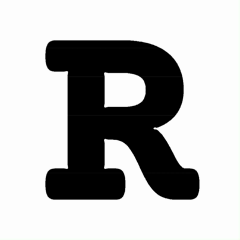
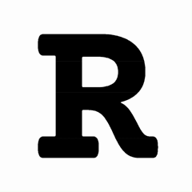

# ∇ Nabla Type: Reaction-Diffusion Font Generator

> **⚠️ Work in Progress** - This is an experimental tool for generating fonts using reaction-diffusion simulations. Currently focused on implementing core functionality. UI/UX improvements will come later.

**Nabla Type** (named after the ∇ symbol, or "nabla", used in the reaction-diffusion equations) transforms any typeface into organic, living typography using GPU-accelerated pattern generation. Each glyph becomes a seed for beautiful, naturally-evolving patterns that can be exported as vector fonts.

**Forked from:** [Jason Webb's Reaction-Diffusion Playground](https://github.com/jasonwebb/reaction-diffusion-playground) - an incredible foundation for exploring reaction-diffusion simulations.


*Real-time reaction-diffusion simulation on custom typography using [Courier Prime](https://fonts.google.com/specimen/Courier+Prime)*

## About This Project

This tool was created as part of the [**Type Design**](https://agdm.fi.muni.cz/en/study/courses/type-design) course at the **Faculty of Informatics, Masaryk University**.

**Why "Nabla"?** The project is named after the **∇** (nabla) symbol, the del operator used in the reaction-diffusion equations. Specifically, **∇²** (the Laplacian) appears in both equations and determines how the chemicals diffuse through the medium. It's the mathematical heart of the pattern formation, making it a fitting namesake for a typography tool built on these equations.

While traditional type design relies on manual bezier curve manipulation, this project investigates how algorithmic processes, specifically reaction-diffusion systems, can create organic, evolving letterforms that would be nearly impossible to design by hand.

## Project Goal

Create an **open-source tool** that lets anyone generate unique fonts by seeding reaction-diffusion simulations with letterforms. The complete pipeline:

1. **Input**: Upload TTF/OTF fonts or use system fonts
2. **Simulation**: GPU-accelerated Gray-Scott reaction-diffusion on glyph shapes
3. **Export**: High-quality SVG paths + complete font files (OTF/TTF)

## Current Status

**Focus:** Building the core V-R-R-V (Vector→Raster→Raster→Vector) pipeline before polishing the interface.

✅ **Working:**
- Custom font loading with OpenType.js
- Text seed generation with blur/grayscale/boldness controls
- Boundary conditions to constrain patterns within glyph shapes
- Real-time GPU simulation (WebGL/Three.js)
- SVG export with path simplification via Paper.js
- Descriptive export filenames with metadata

🚧 **In Development:**
- Glyph navigation system (A-Z, a-z, 0-9, punctuation)
- Batch processing and font generation
- Project save/load functionality

📋 **Planned:**
- Complete font export (OTF/TTF)
- Batch ZIP export
- Typography guidelines
- UI/UX overhaul

## Pattern Examples

Different reaction-diffusion presets create dramatically different organic patterns:

<table>
  <tr>
    <td width="33%" align="center">
      <br/>
      <b>Precritical Bubbles</b><br/>
      <em>Stable bubble formations</em>
    </td>
    <td width="33%" align="center">
      <br/>
      <b>Positive Bubbles</b><br/>
      <em>Growing bubble patterns</em>
    </td>
    <td width="33%" align="center">
      <br/>
      <b>Default + Boundary</b><br/>
      <em>Constrained to glyph shape</em>
    </td>
  </tr>
</table>

*The third example showcases the boundary conditions feature, which constrains pattern growth to stay within the original letterform outline.*

## What is Reaction-Diffusion?

Reaction-diffusion is a mathematical model describing how two chemicals might _react_ to each other as they _diffuse_ through a medium together. It was [proposed by Alan Turing in 1952](https://www.dna.caltech.edu/courses/cs191/paperscs191/turing.pdf) as a possible explanation for how patterns like zebra stripes and leopard spots form.


_Credit to [Karl Sims](https://www.karlsims.com/rd.html) for the equation illustration._

The key parameters we can control:
- `f` - feed rate (how much chemical A is added)
- `k` - kill rate (how much chemical B is removed)
- `dA` - diffusion rate for chemical A
- `dB` - diffusion rate for chemical B


## Getting Started

1. **Clone and install:**
   ```bash
   git clone https://github.com/aykoooo/nabla-type.git
   cd nabla-type
   npm install
   ```

2. **Run the development server:**
   ```bash
   npm start
   ```
   Open http://127.0.0.1:9001/ in your browser.

3. **Basic workflow:**
   - Upload a font file (TTF/OTF) or use system fonts
   - Type text to use as simulation seed
   - Adjust reaction-diffusion parameters (f, k, dA, dB)
   - Let the simulation evolve
   - Export as SVG when satisfied

## Technical Implementation

### V-R-R-V Pipeline

The project uses a four-stage pipeline to transform vector fonts into organic patterns:

**1. Vector Input (TTF/OTF)**
↓ *Parse with OpenType.js*

**2. Raster Seeding (Canvas 2D)**
↓ *Render glyph paths as ImageData*

**3. Raster Simulation (WebGL/GPU)**
↓ *Apply Gray-Scott equations via GLSL shaders*

**4. Vector Output (SVG/Fonts)**
↓ *Vectorize with Potrace, clean up with Paper.js*

### Core Technologies

**Inherited from original:** WebGL/Three.js GPU acceleration, GLSL shaders, real-time reaction-diffusion simulation

**Added for font generation:**
- **OpenType.js**: Font parsing and glyph rendering  
- **Potrace-wasm**: Bitmap vectorization
- **Paper.js**: SVG path simplification and cleanup
- **Boundary conditions system**: Constrains patterns within letterform shapes


## Current Features (WIP)

> **Note:** Interface is functional but not polished. Focus is on getting the core pipeline working correctly.

### Text Seeding
- Upload custom fonts (TTF, OTF) or use system fonts
- Multi-line text support with proper centering
- Boldness control (stroke width for custom fonts, weight mapping for system fonts)
- Blur and grayscale options for seed preprocessing
- Rotation support

### Simulation Control
- Real-time parameter adjustment (f, k, dA, dB)
- Preset configurations (Worms, Spots, Maze, etc.)
- Iteration control with auto-pause
- Interactive parameter map for exploration
- Boundary constraints (exact, padded, eroded, soft, inverted)

### Export System
- SVG export with path simplification
- PNG raster export
- Descriptive filenames with metadata
- Custom font names preserved in export filenames

### Advanced Features
- Style maps for spatially-varying parameters
- Bias controls for directional diffusion
- Mouse interaction for adding chemical B
- Keyboard shortcuts

## Development Roadmap

**Next priorities:**
1. **Glyph Navigation** - A-Z, a-z, 0-9 character switching
2. **Font Export** - Complete OTF/TTF generation pipeline
3. **Batch Processing** - Generate entire character sets
4. **UI Overhaul** - Proper font creation interface

**Later:**
- Project save/load
- Kerning and metrics
- Variable font support
- Advanced export options


## Contributing

This is an experimental open-source project! While the focus is currently on core functionality rather than user experience, contributions are welcome:

- 🐛 **Bug reports** - Help identify issues
- 💡 **Feature suggestions** - Ideas for the font creation workflow
- 🔧 **Pull requests** - Code improvements and fixes
- 📖 **Documentation** - Help explain the process

## Acknowledgments

**Original work:** [Jason Webb's Reaction-Diffusion Playground](https://github.com/jasonwebb/reaction-diffusion-playground) - The incredible foundation this project is built upon.

**Key references:**
- [Karl Sims](https://www.karlsims.com/rd.html) - Reaction-diffusion tutorial and equation visualization
- [Robert Munafo](https://mrob.com/pub/comp/xmorphia/) - Gray-Scott parameter space exploration
- [Alan Turing](https://www.dna.caltech.edu/courses/cs191/paperscs191/turing.pdf) - The original 1952 paper

## License

<a rel="license" href="http://creativecommons.org/licenses/by-nc-sa/4.0/"></a>

This work is licensed under a [Creative Commons Attribution-NonCommercial-ShareAlike 4.0 International License](http://creativecommons.org/licenses/by-nc-sa/4.0/), matching the original project.

**This means:**
- ✅ Share and adapt the code freely
- ✅ Must give appropriate credit
- ✅ Must share modifications under the same license
- ❌ Cannot use for commercial purposes
