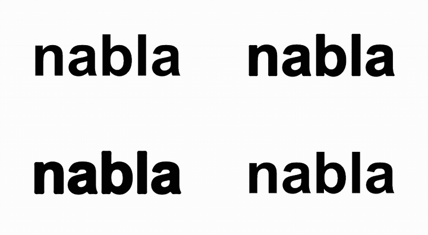

# Nabla Type



Nabla Type turns glyph masks into living, organic letterforms. 

**Live demo:** [nablatype.ayko.ooo](https://nablatype.ayko.ooo/)

## About

This project was created for the [Type Design](https://agdm.fi.muni.cz/en/study/courses/type-design) course at the Faculty of Informatics, Masaryk University.

Traditional type design relies on manual Bézier curve manipulation. Nabla Type explores how algorithmic processes, specifically reaction-diffusion systems, can generate organic, evolving letterforms that would be nearly impossible to draw by hand.

**Why "Nabla"?** The name comes from the **∇** (nabla) operator used in the reaction-diffusion equations. The **∇²** Laplacian determines how the two chemicals diffuse through the medium, making it the mathematical heart of the pattern formation.

## Features

### Simulation
- **Real-time Gray-Scott reaction-diffusion** on WebGL1 with `OES_texture_float` and ping-pong float framebuffers.
- **Live parameter control** — adjust feed `f`, kill `k`, diffusion `dA`/`dB`, and `dt` without restarting the simulation.
- **Interactive Pearson parameter-space map** — explore pattern presets with a [Karl Sims](https://www.karlsims.com/rd.html)-style warp.
- **Built-in pattern presets** — worms, spots, and other classic Gray-Scott regimes.
- **Resolution & aspect control** — adjustable simulation size and aspect ratio.
- **Steps-per-frame** — run multiple simulation steps per animation frame (default 8).

### Seeding & Typography
- **Text-to-glyph seeding** — type text and seed the simulation from rasterized glyph masks.
- **Custom font loading** — upload TTF/OTF files or use system fonts.
- **Adjustable seed font size**.

### Color & Visualization
- **LUT-based colormap system** — 13 built-in JSON colormaps.
- **Gradient editor** — create custom colormaps.
- **Black/white threshold mode** — bypass the LUT for high-contrast output.

### Workflow & State
- **Play/pause, reseed, clear, save** — full playback control.
- **Pause snapshots** — capture and restore an exact simulation state.
- **Multi-step undo** — up to 50 full-state snapshots including params, colormap, seed, and resolution.
- **Custom timeline track** — buffer-fill bar, pause markers, draggable cursor, and configurable replay window.
- **Replay system** — ring-buffer capture with configurable FPS and `maxFramesBack`.

### Export
- **SVG export** — vectorize output with scale and padding controls.
- **PNG export** — raster export with scale and padding controls.

### Interface
- **Pan/zoom viewport** — navigate the canvas freely.
- **Keyboard shortcuts** — fast control over playback and state.
- **Live FPS display** — monitor simulation performance.

## Quick Start

```bash
git clone https://github.com/aykoooo/nabla-type.git
cd nabla-type
npm install
npm run dev
```

Type some text, pick a colormap, adjust feed/kill parameters, and export when satisfied.

## Tech Stack

- **Svelte 5** (runes) + **Vite 7**
- **TypeScript**
- **WebGL1** + **regl** — GPU simulation via fragment shaders
- **opentype.js** — font parsing and glyph rendering
- **potrace-plus** — bitmap vectorization for SVG export
- **Tailwind CSS 4** + **bits-ui** — UI components and styling

## Acknowledgments

- **[Karl Sims](https://www.karlsims.com/rd.html)** — for the reaction-diffusion tutorial and the parameter-space map technique used in the Pearson map.
- **[Jason Webb](https://github.com/jasonwebb/reaction-diffusion-playground)** — for the early reaction-diffusion playground that inspired this direction.

## License

MIT
